<!-- README.md -->

# TASK MANAGER Project
A simple task manager built with Python and SQL Database.

## Description
This project is a simple task manager that stores tasks in a relational database (initially SQLite).  
It allows users to create, view, update, and delete tasks through a basic terminal interface.

## How to Install and Run
*Explain commands to setup and run the project in details*
1. Clone this repository:
   ```bash
   git clone https://github.com/AlissonCasagrande/task-manager.git
   cd task-manager
   ```
2. Create the database by running:
   ```
   python setup_db.py
   ```
3. Start the application:
   Choose your preferred interface to run the project:
   - For CLI (Terminal):
      ```
      python main.py
      ```
   - For GUI (Desktop Window):
      ```
      python desktop_main.py
      ```
### Requirements
- Python 3.x installed on your system.
- Standard library modules:
   - sqlite3, os, datetime, tkinter

> **Note:** Most modules are part of Python's standard library. However, some Linux distributions (like Ubuntu/Debian) do not include Tkinter by default. 
> If you encounter an error, you may need to install it manually:
```
sudo apt update
sudo apt install python3-tk
```

## 🖥️ Usage on GUI/Desktop window
1. Use the terminal for launch the application:
`python desktop_main.py`
2. The main window will display the current task list. From there, you can:
   - Click "Add Task" to create a new entry.
   - Select an existing task to Update its details or Delete it from the database.

## 📸 Screenshots (GUI)

### Main Dashboard & Status Filtering
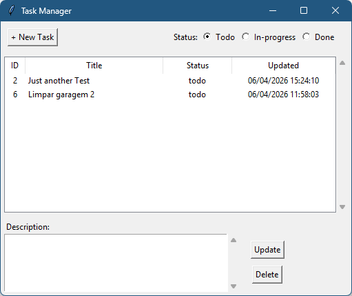 <br>
*View and filter your tasks by status.*

---

### Creating a New Task
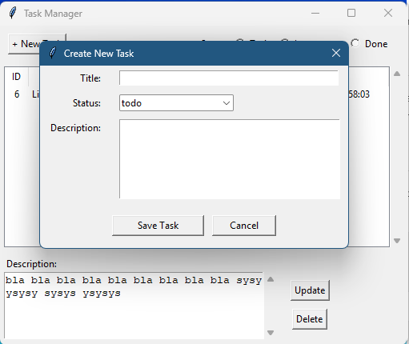 <br>
*Modal window for task input*

---

### Editing Task Details
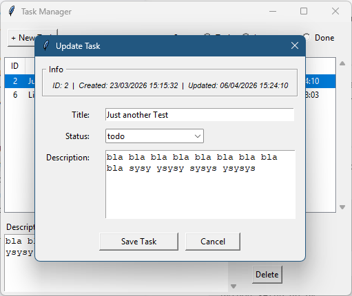 <br>
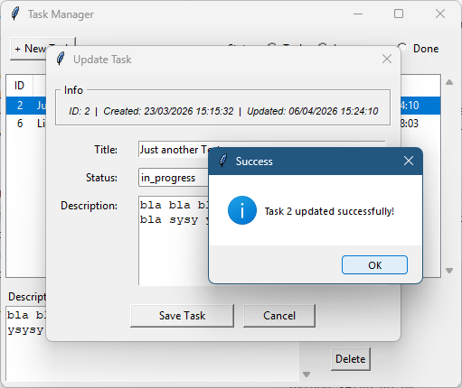<br>
*Updating existing records with success feedback.*

---

### Data Safety (Delete task)
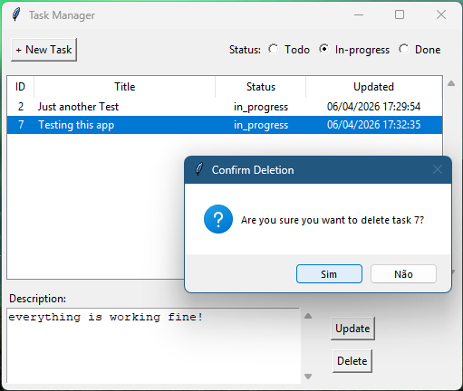 <br>
*Confirmation prompt before deleting a task.*

---

## 🖥️ Usage (CLI)
The terminal interface allows for quick task management.
**Basic Workflow:**
1. Launch the application: `python main.py`
2. Main menu options:
   - `1` → List Tasks: View all recorded entries.
   - `2` → Add task: Create a new record in the database.
   - `Q` → Quit: Safely close the application.
3. Once a task is selected, you can perform **Update** or **Delete** actions.

## 📸 Screenshots (CLI)

### Main Menu
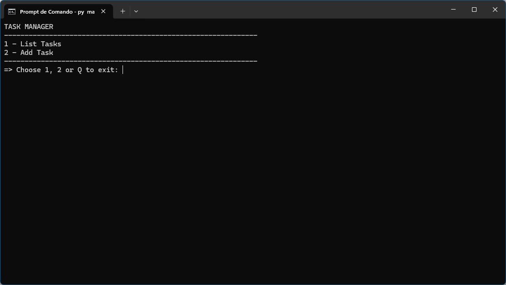

### Add Task
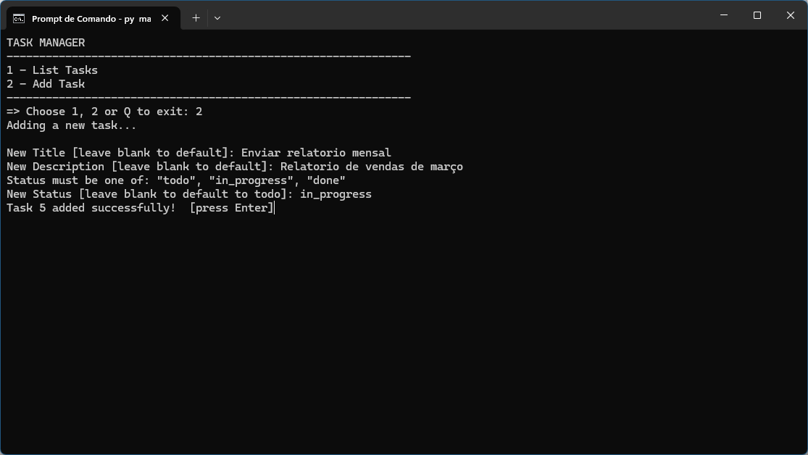

### List Tasks
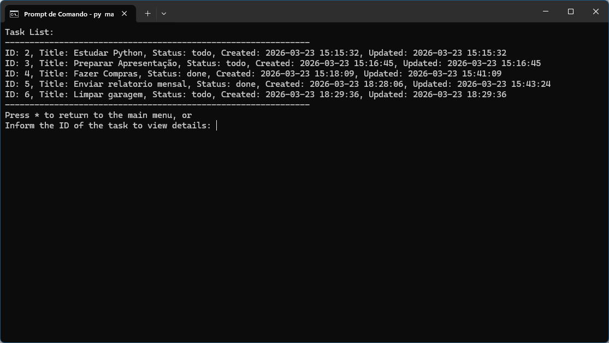

### View details
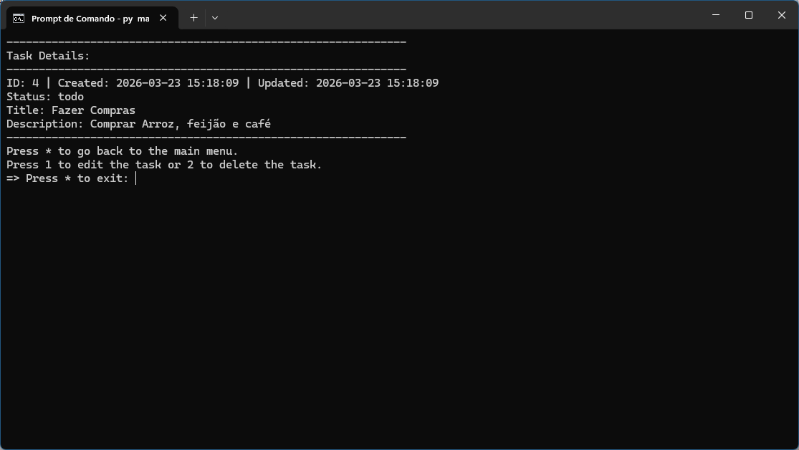

### Edit task
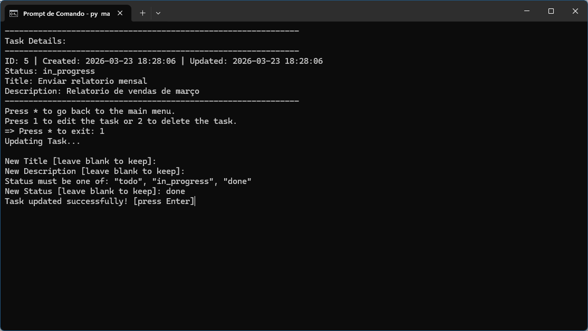

### Delete task
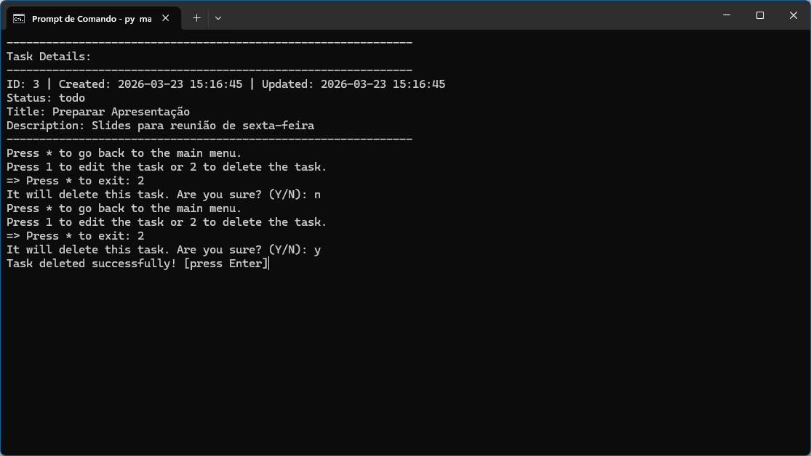

---

## Available Interfaces
- **CLI (Terminal)** → currently implemented (see screenshots above)
- **Desktop GUI (Tkinter-based)** → Fully implemented and functional
- **Mobile (Kivy)** → Planned/Upcoming.
- **Web (Django/Flask)** → Planned/In development.

## 🚀 Roadmap
- [x] Initial CLI version (Terminal)
- [x] Desktop Interface (Tkinter)
- [ ] Web Interface with Django
- [ ] REST API for integration
- [ ] Modern Frontend (React/Vue/Angular)
- [ ] AWS Cloud Deployment (EC2, RDS, S3)

## Credits
[Alisson Guindo Casagrande] (https://github.com/AlissonCasagrande) (2026)

## Contribute
Contributions are welcome!
Please check the [CONTRIBUTING](CONTRIBUTING.md) file for guidelines.

## License
This project is licensed under the MIT License — see the [LICENSE](LICENSE) file for details.


<!-- END README.md -->